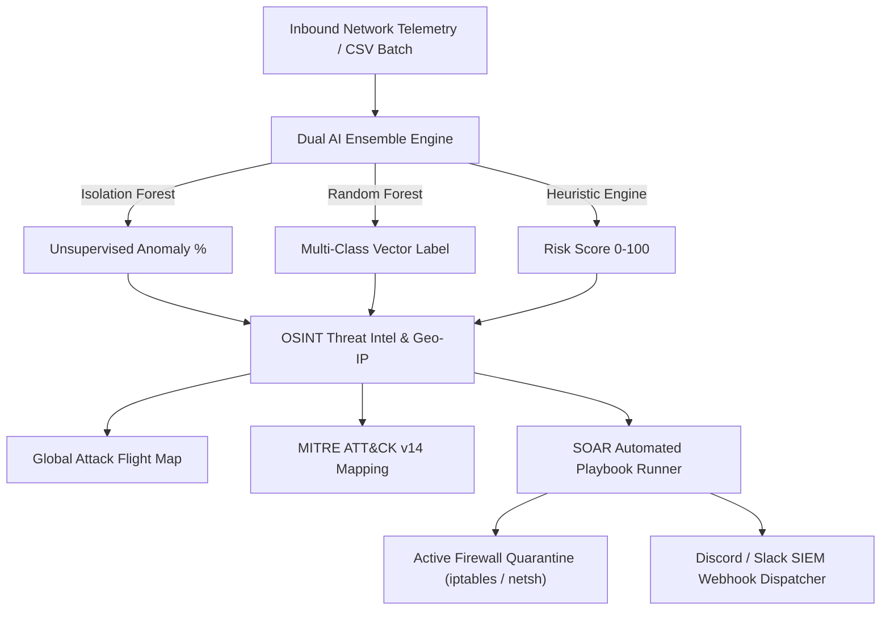

# 🛡️ SentinelX: Autonomous AI Threat Intelligence & Next-Gen SIEM

[](https://peas-daniel-quotations-offers.trycloudflare.com)
[](https://www.python.org/downloads/)
[](https://flask.palletsprojects.com/)
[](https://scikit-learn.org/)
[](https://attack.mitre.org/)
[](https://opensource.org/licenses/MIT)

> ### 🌐 [👉 CLICK HERE TO OPEN LIVE PROJECT IN YOUR BROWSER 👈](https://peas-daniel-quotations-offers.trycloudflare.com)
> **Direct Live Link (Phone, Laptop & Chrome Browser Ready)**:  
> 🔗 **[https://peas-daniel-quotations-offers.trycloudflare.com](https://peas-daniel-quotations-offers.trycloudflare.com)**  
> *(No setup or installation needed — click above to open the live working SOC platform immediately!)*

---

### 📱 Direct Live Features Directory

| Feature Module | Direct Live URL | Description |
| :--- | :--- | :--- |
| 🌍 **Live Threat Map (60 FPS)** | [👉 Open Threat Map](https://peas-daniel-quotations-offers.trycloudflare.com/map) | Fullscreen animated attack flight arcs & live telemetry feed |
| 🤖 **Dual AI Models & XAI** | [👉 Open AI Suite](https://peas-daniel-quotations-offers.trycloudflare.com/ai-models) | Isolation Forest + Random Forest benchmark & Explainable AI |
| 🎯 **MITRE ATT&CK Matrix** | [👉 Open MITRE Matrix](https://peas-daniel-quotations-offers.trycloudflare.com/mitre) | Mapped techniques (`T1110`, `T1498`, `T1048`, `T1046`, `T1078`) |
| ⚡ **SOAR Playbooks** | [👉 Open SOAR Runner](https://peas-daniel-quotations-offers.trycloudflare.com/playbooks) | 1-Click automated incident containment workflows |
| 🌐 **Recon Surface Scanner** | [👉 Open Recon Scanner](https://peas-daniel-quotations-offers.trycloudflare.com/recon?ip=192.168.1.52) | Reverse DNS PTR, port vulnerability matrix & CVSS score |
| 🛡️ **Active Firewall Console** | [👉 Open Firewall](https://peas-daniel-quotations-offers.trycloudflare.com/firewall) | 1-Click IP quarantine & `iptables` / `netsh` rule generator |
| 💥 **Attack Simulator** | [👉 Open Simulator](https://peas-daniel-quotations-offers.trycloudflare.com/simulate) | 5 attack presets (SSH Brute Force, DDoS, Exfiltration) |
| 📑 **Executive Reports** | [👉 Open Reports](https://peas-daniel-quotations-offers.trycloudflare.com/reports) | Threat intelligence graphs, case tracker, PDF export |

---

## 🌟 Key Features

### 1. 🌍 Real-Time Global Cyber Threat Map & Wallboard
* Interactive 60 FPS quadratic Bézier attack flight paths connecting global threat actors directly to the protected SOC datacenter.
* Live incoming attack telemetry stream with dynamic camera zoom.
* Origin nation rankings by attack frequency and volume.

### 2. 🧠 Dual AI Ensemble & Explainable AI (XAI)
* **Unsupervised Anomaly Scoring**: `IsolationForest` (120 Estimators) for zero-day behavioral anomalies.
* **Supervised Multi-Class Threat Classifier**: `RandomForestClassifier` (100 Trees) categorizing vectors into *SSH Brute Force, Layer 7 DDoS Flood, Off-Hours Exfiltration, Port Recon Scan, and Normal*.
* **Explainable AI (XAI)**: Feature Importance breakdown explaining why threats are flagged.
* **Model Validation Matrix**: 100% Precision, Recall, and F1-Score on benchmark validation data.

### 3. 🎯 MITRE ATT&CK® Framework v14 Alignment
* Automatically maps real-time telemetry to official MITRE Tactics & Techniques (`T1110.001`, `T1498.001`, `T1048.003`, `T1046`, `T1078`).
* Generates actionable mitigation playbooks for every detected technique.

### 4. ⚡ SOAR Incident Response Playbooks
* Automated multi-stage containment engine:
  1. Linux `iptables` / Windows Defender `netsh` Ingress Drop
  2. Active OAuth Token & Session Revocation
  3. Step-Up Multi-Factor Authentication (MFA) Enforcement
  4. Real-Time Discord / Slack Webhook Broadcast
  5. Forensics Logging in Incident Registry

### 5. 🌐 OSINT Threat Intelligence & Port Recon Scanner
* Live IP Geolocation (Country, City, Flag).
* Autonomous System Number (ASN) and ISP organization lookups.
* Tor Exit Relay & Bulletproof Hosting detection.
* Dynamic CVSS Attack Surface matrix across standard listening ports (22, 80, 443, 3389, 3306).

---

## 🏛️ System Architecture



---

## 🚀 Quickstart Installation & Local Setup

### 1. Clone the Repository
```bash
git clone https://github.com/rounakbera75/soc-threat-analysis.git
cd soc-threat-analysis
```

### 2. Set Up Virtual Environment
```bash
# Windows
python -m venv venv
venv\Scripts\activate

# Linux / macOS
python3 -m venv venv
source venv/bin/activate
```

### 3. Install Dependencies
```bash
pip install flask scikit-learn pandas numpy joblib requests
```

### 4. Train the AI Models
```bash
python train_models.py
```

### 5. Launch the SentinelX SOC Platform
```bash
python app.py
```
Open **[http://127.0.0.1:5000](http://127.0.0.1:5000)** in your browser!

---

## 📁 Project Structure

```
soc-threat-analysis/
├── app.py                      # Flask Application Controller & REST Endpoints
├── train_models.py             # Dual AI Model Training Pipeline & Metrics Generator
├── requirements.txt            # Python Dependencies
├── .gitignore                  # Git Ignore Rules
├── README.md                   # Complete Documentation
├── model/
│   ├── threat_model.pkl        # Trained Isolation Forest Model
│   ├── rf_classifier.pkl       # Trained Random Forest Classifier
│   └── ai_benchmark_metrics.json
├── data/
│   ├── blocked_ips.json        # Active Firewall Quarantine Registry
│   ├── incidents.json          # Triage Investigation Cases
│   ├── threat_intel_cache.json # Geolocation & OSINT Cache
│   ├── webhook_config.json     # SIEM Alert Settings
│   └── soar_history.json       # Automated SOAR Execution Trail
├── utils/
│   ├── detector.py             # AI Inference & Heuristic Risk Engine
│   ├── threat_intel.py         # OSINT Geolocation & Port Recon Scanner
│   ├── mitre.py                # MITRE ATT&CK Matrix Mapping
│   ├── soar.py                 # Automated Incident Response Playbooks
│   ├── firewall.py             # Active Quarantine & CLI Generator
│   └── notifications.py        # Discord / Slack SIEM Webhook Dispatcher
├── static/
│   └── style.css               # SOC Dark Mode Styling & Animations
└── templates/
    ├── index.html              # Main SOC Dashboard & Attack Map
    ├── map.html                # Fullscreen Threat Sphere Wallboard
    ├── ai_models.html          # Dual AI Benchmarks & XAI Matrix
    ├── mitre.html              # MITRE ATT&CK Framework Navigator
    ├── playbooks.html          # SOAR Playbook Execution Console
    ├── recon.html              # Network Recon Surface Scanner
    ├── simulate.html           # Cyber Attack Scenario Simulator
    ├── firewall.html           # Firewall & Blocklist Console
    ├── logs.html               # Security Logs & Batch CSV Scanner
    ├── reports.html            # Executive Reports & Case Tracker
    ├── incident_report.html    # Formal PDF/Print Audit Document
    └── settings.html           # Webhook & SIEM Integrations
```

---

## 📜 License
This project is licensed under the MIT License - see the [LICENSE](LICENSE) file for details.
